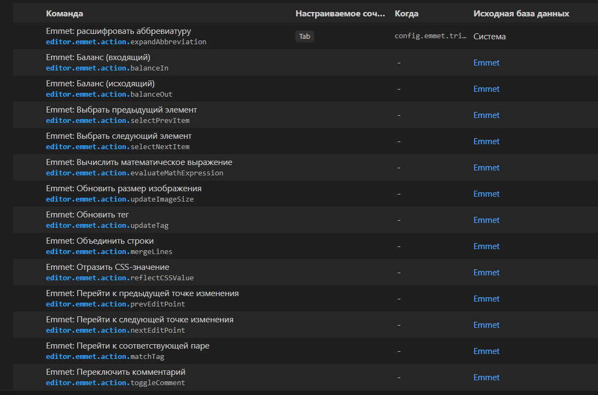
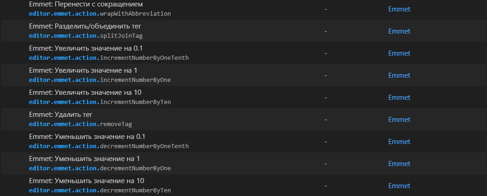
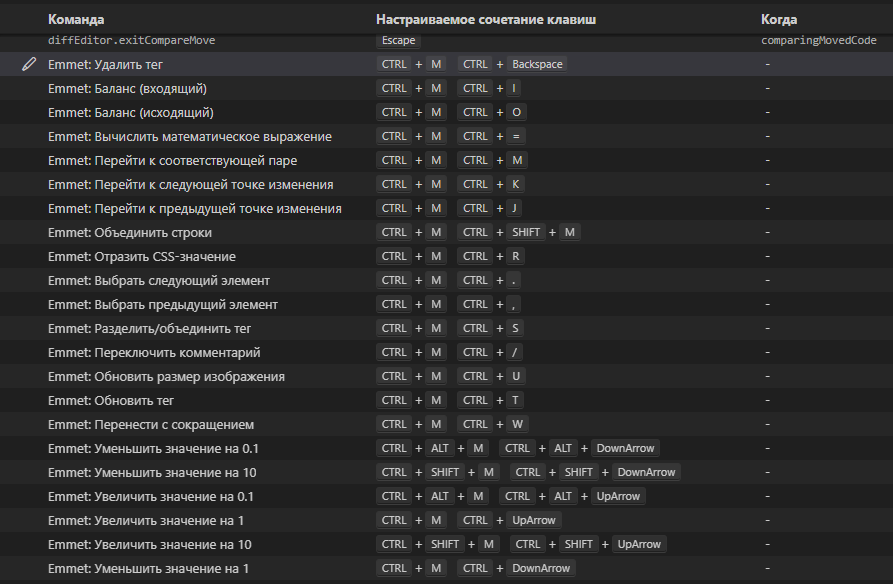
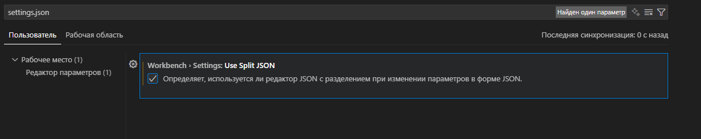

# Emmet-commands-and-Keyboard-Shortcuts.io

        

        ##Содержание

        <ol>
            <li><a href="#Content2" class="underline">Расширение аббревиатур</a>

                <ol>
                    <li><a href="#Content21" class="underline">Синтаксис сокращений</a></li>
                    <li><a href="#Content22" class="underline">Операторы вложенности</a></li>
                    <li><a href="#Content23" class="underline">Умножение</a></li>
                    <li><a href="#Content24" class="underline">Комбинирование</a></li>
                    <li><a href="#Content25" class="underline">Операторы атрибутов</a></li>
                    <li><a href="#Content26" class="underline">Добавляем текст</a></li>
                    <li><a href="#Content27" class="underline">«Рыба» текста — Lorem Ipsum</a></li>
                    <li><a href="#Content28" class="underline">Псевдонимы</a></li>

                </ol>
            </li>

            <li><a href="#Content3" class="underline">Emmet actions (<i>Действия Эммета</i></a> )
                <ol>
                    <li><a href="#Content31" class="underline">Как настроить параметры Emmet?</a></li>
                    <li><a href="#Content32" class="underline">Меню привязки ключей Emmet</a></li>
                    <li><a href="#Content33" class="underline">Итог настройки Emmet</a></li>
                    <li><a href="#Content34" class="underline">Удалить Тег</a></li>
                    <li><a href="#Content35" class="underline">Баланс (Входящий)</a></li>
                    <li><a href="#Content36" class="underline">Баланс (Исходящий)</a></li>
                    <li><a href="#Content37" class="underline">Вычислить Математическое выражение</a></li>
                    <li><a href="#Content38" class="underline">Перейдите к Соответствующей паре</a></li>
                    <li><a href="#Content39" class="underline">Перейти к следующей точке изменения</a></li>
                    <li><a href="#Content310" class="underline">Перейти к предыдущей точке изменения</a></li>
                    <li><a href="#Content311" class="underline">Объединить строки</a></li>
                    <li><a href="#Content312" class="underline">Отразить CSS-значение</a></li>
                    <li><a href="#Content313" class="underline">Выбрать следующий элемент</a></li>
                    <li><a href="#Content314" class="underline">Разделить/объединить тег</a></li>
                    <li><a href="#Content315" class="underline">Переключить комментарий</a></li>
                    <li><a href="#Content316" class="underline">Обновить размер изображения</a></li>
                    <li><a href="#Content317" class="underline">Обновить тег</a></li>
                    <li><a href="#Content318" class="underline">Перенести с сокращением</a></li>
                    <li><a href="#Content319" class="underline">Уменьшить на 0,1</a></li>
                    <li><a href="#Content320" class="underline">Уменьшить На 1</a></li>
                    <li><a href="#Content321" class="underline">Уменьшить На 10</a></li>
                    <li><a href="#Content322" class="underline">Увеличить на 0,1</a></li>
                    <li><a href="#Content323" class="underline">Увеличить на </a>1</li>
                    <li><a href="#Content324" class="underline">Увеличить на 10</a></li>

                </ol>
            </li>
        </ol>

        
<a href="https://docs.emmet.io/" target="_blank" rel="noopener noreferrer">Документация Emmet.</a>
        

        

            <h2 id="Content2"><a class="anchor" href="#Content2">#</a>Расширение аббревиатур </h2>

            
Сокращения - это основа инструментария Emmet: эти специальные выражения анализируются во
                время выполнения и
                преобразуются в структурированный блок кода, например, HTML.  Синтаксис аббревиатур
                похож
                на CSS-селекторы с несколькими
                расширениями, специфичными для генерации кода. Так что каждый веб-разработчик уже знает,
                как им пользоваться.

                Вот пример: эта аббревиатура

            <strong>#page&gt;div.logo+ul#navigation&gt;li*5&gt;a{Item $}</strong>

            

                &lt;div id="page"&gt;  
                &nbsp;&nbsp;&lt;div class="logo"&gt;&lt;/div&gt;  
                &nbsp;&nbsp;&lt;ul id="navigation"&gt; 
                &nbsp;&nbsp;&nbsp;&nbsp;&lt;li&gt;&lt;a href=""&gt;Item 1&lt;/a&gt;&lt;/li&gt; 
                &nbsp;&nbsp;&nbsp;&nbsp;&lt;li&gt;&lt;a href=""&gt;Item 2&lt;/a&gt;&lt;/li&gt; 
                &nbsp;&nbsp;&nbsp;&nbsp;&lt;li&gt;&lt;a href=""&gt;Item 3&lt;/a&gt;&lt;/li&gt; 
                &nbsp;&nbsp;&nbsp;&nbsp;&lt;li&gt;&lt;a href=""&gt;Item 4&lt;/a&gt;&lt;/li&gt; 
                &nbsp;&nbsp;&nbsp;&nbsp;&lt;li&gt;&lt;a href=""&gt;Item 5&lt;/a&gt;&lt;/li&gt; 
                &nbsp;&nbsp;&lt;/ul&gt; 
                &lt;/div&gt;
            

            

                

                <ul id="navigation">
                    <li><a href="">Item 1</a></li>
                    <li><a href="">Item 2</a></li>
                    <li><a href="">Item 3</a></li>
                    <li><a href="">Item 4</a></li>
                    <li><a href="">Item 5</a></li>
                </ul>
            

             
            <a href="#Content1">&lt;&lt;&lt;</a>

            

                <h2 id="Content21"><a class="anchor" href="#Content21">#</a>Синтаксис сокращений</h2>

                
В этом и есть принцип работы Emmet — пишем простые сокращения, нажимаем TAB и они
                    разворачиваются в сложные фрагменты
                    кода. Покажем на примере тега div: чтобы его развернуть, пишем div, нажимаем TAB
                    и
                    разворачивается тег.  
                     
                    Здесь нет определенного набора тегов — каждый разработчик может написать любое
                    слово и
                    преобразовать его в тег, который
                    ему будет удобно использовать. Если написать test и нажать TAB — получится тег:
                    . Таких
                    тегов может быть сколько угодно
                    — все зависит от ваших задач и фантазии.

                    Можно использовать имена элементов, такие как div для создания HTML-тегов.
                

                <h4>Основные операции в Emmet</h4>

                
Итак, для написания HTML в Emmet используются 12 типов селекторов:

                <ol>
                    <li><kbd>#</kbd>— создает атрибут id</li>
                    <li><kbd>.</kbd> — создает атрибут class</li>
                    <li><kbd>[</kbd><kbd>]</kbd> — создает любые другие атрибуты, в том числе и пользовательские</li>
                    <li><kbd>&gt;</kbd> — делает переход на один уровень ниже</li>
                    <li><kbd>+</kbd> — создает соседние элементы на том же уровне</li>
                    <li><kbd>^</kbd> — делает переход на уровень вверх</li>
                    <li><kbd>*</kbd> — умножает элементы</li>
                    <li><kbd>$ </kbd>— заменяется числом, каждый раз увеличивающимся на единицу</li>
                    <li><kbd>$</kbd> <kbd>$</kbd> — то же самое, только двухзначное</li>
                    <li><kbd>{</kbd> <kbd>}</kbd>— добавляет текстовое содержимое элементам</li>
                    <li><kbd>(</kbd> <kbd>)</kbd>— группирует элементы</li>
                    <li><kbd>:</kbd> — используется для некоторых элементов, таких как &lt;input&gt;, &lt;a&gt;,
                        <link> и др., и задает для них атрибуты
                    </li>
                </ol>

                <h4>Условные комментарии</h4>

                
С помощью команд
                
 HTML
                     
                     
                    cc:ie
                     
                

                и

                
 HTML
                     
                     
                    cc:noie
                     
                

                можно добавить условные комментарии. Команда cc:ie выдает разметку, код внутри которой
                будет распознаваться только Internet Explorer, cc:noie, наборот, генерирует комментарии, содержимое
                которых будет
                доступно только всем остальным браузерам. Результат выполнения первой:

                
 HTML
                     
                     
                    &lt;!--[if IE]&gt;  
                    &lt;![endif]--&gt;
                     
                

                
и второй:

                
 HTML
                     
                     
                    &lt;!--[if !IE]&gt;  
                    &lt;![endif]--&gt;
                     
                

                <h4>Элементы</h4>

                
Вы можете использовать названия элементов, такие как div или p, для создания
                    HTML-тегов. В
                    Emmet нет предопределенного
                    набора доступных имен тегов, вы можете написать любое слово и преобразовать его
                    в тег:
                

                

                    div → &lt;div&gt;&lt;/div&gt;  foo → &lt;foo&gt;&lt;/foo&gt;  
                

                

                <footer></footer>
                

                

                <foo></foo>

                
<a href="https://webdesign-master.ru/blog/html-css/2.html" target="_blank"
                        rel="noopener noreferrer">Справочник EMMET
                        сокращений для ускорения верстки</a> 
                    "https://webdesign-master.ru/blog/html-css/2.html"
                

            

            <a href="#Content1">&lt;&lt;&lt;</a>

            

                <h2 id="Content22"><a class="anchor" href="#Content22">#</a>Операторы вложенности</h2>

                Задать положение элементов внутри генерируемого дерева — должны ли они быть внутри или
                рядом с элементом контекста — помогают операторы вложенности. Их четыре: «дочерние
                    элементы», «соседние
                    элементы», «группировка» и «поместить выше».

                <ol>
                    <li>
                        <h5>Дочерние элементы</h5>

                        
Для вложения элементов друг в друга используют дочерние элементы,
                            которые обозначают
                            оператором «&gt;» — знак «больше». Для
                            примера, возьмем такое сокращение: div&gt;ul&gt;li, то
                            есть — div, в
                            который
                            вложен список ul и элементы списка li. Нажимаем
                            TAB и разворачиваем большой кусок кода.  
                             
                            Используется оператор &gt; для вложения элементов друг в друга:
                             
                             
                            <strong>div&gt;ul&gt;li</strong>
                        

                        
 HTML
                             
                             
                            &lt;div&gt; 
                            &nbsp;&nbsp;&lt;ul&gt; 
                            &nbsp;&nbsp;&nbsp;&nbsp; &lt;li&gt;&lt;/li&gt;  
                            &nbsp;&nbsp;&lt;/ul&gt; 
                            &lt;/div&gt; 
                             
                        

                        
Оператор «&gt;» используют для обозначения вложенности элементов друг в
                            друга. Пишем в
                            несколько
                            раз меньше текста и
                            получаем полноценный кусок кода.

                    </li>

                    <li>
                        <h5>Соседние элементы</h5>
                        
Элементы, которые находятся друг под другом называют соседними и
                            обозначают оператором +» — знак «плюс»«. Допустим,
                            требуется написать типовой макет страницы,  
                            где есть:
                        <ul>
                            <li><strong>header </strong>— «шапка» сайта;</li>
                            <li><strong>main </strong>— основной контент;</li>
                            <li><strong>sidebar</strong> — боковая панель сайта;</li>
                            <li><strong>footer</strong> — «подвал» сайта.</li>
                        </ul>
                        

                        
Пишем: header+main+sidebar+footer, нажимаем TAB и получаем каждый тег
                            друг под другом.  
                             
                            Для размещения элементов рядом друг с другом, на одном уровне,
                            используется оператор+:
                        

                        
<strong>header+main+sidebar+footer</strong>

                        
 HTML
                             
                             
                            &lt;header&gt;&lt;/header&gt;  
                            &lt;main&gt;&lt;/main&gt;  
                            &lt;sidebar&gt;&lt;/sidebar&gt;  
                            &lt;footer&gt;&lt;/footer&gt;  
                             
                        

                        
Для обозначения соседних элементов используют оператор
                                «+». Emmet разворачивает небольшой текст в
                            несколько тегов друг
                            под другом.

                    </li>
                    <li>
                        <h5>Группировка</h5>
                        
С помощью круглых скобок «()» можем группировать
                            элементы с разным
                            уровнем вложенности. Допустим, хотим создать страницу
                            с header и footer, а между ними поместить основной контент и
                            боковую панель сайта с соседними операторами вложенности.
                            Тогда прописываем: header+(div&gt;main+aside)+footer — и
                            разворачиваем полноценный кусок кода.  
                             
                            Для группировки элементов используются круглые скобки  
                             
                            <strong>header+(div&gt;main+aside)+footer</strong>
                        

                        
 HTML
                             
                             
                            &lt;header&gt;&lt;/header&gt; 
                            &lt;div&gt; 
                            &nbsp;&nbsp;&lt;main&gt;&lt;/main&gt; 
                            &nbsp;&nbsp;&lt;aside&gt;&lt;/aside&gt; 
                            &lt;/div&gt; 
                            &lt;footer&gt;&lt;/footer&gt; 
                             
                        

                        
Круглые скобки помогают группировать элементы с разными уровнями
                            вложенности.

                    </li>
                    <li>
                        <h5>Поместить выше</h5>
                        
Этот оператор обозначается знаком «^» —
                            «карет»
                            и помещает тег не выше над элементом, а выше в дереве кода,
                            выводит этот
                            тег из вложенности. На примере: у нас есть тег div, в него
                            вложен main и sidebar. По идее, footer будет на одном уровне
                            с ними, но с помощью оператора «поместить выше» он не будет
                            обернут в div, а выйдет за его пределы и встанет ниже.  
                             
                            Позволяет подняться на один уровень вверх по дереву.  
                             
                            <strong>header+div&gt;main+asideb^footer</strong>
                        

                        
 HTML
                             
                             
                            &lt;header&gt;&lt;/header&gt; 
                            &lt;div&gt; 
                            &nbsp;&nbsp;&lt;main&gt;&lt;/main&gt; 
                            &nbsp;&nbsp;&lt;asideb&gt;&lt;/asideb&gt; 
                            &lt;/div&gt; 
                            &lt;footer&gt;&lt;/footer&gt; 
                             
                        

                        
Оператор <strong>«^</strong>» — поднимает
                            элемент в дереве
                            кода, выводит его из
                            вложенности. Элемент footer выходит из «обертки» тега div
                            и встает выше в дереве кода.  
                             
                            Другой пример: есть div, в него вложен ul и li, а «карет»
                            поднимает p на один уровень — выше ul, но внутри div.  
                             
                            <strong>div&gt;ul&gt;li^p</strong>
                        

                        
 HTML
                             
                             
                            &lt;div&gt; 
                            &nbsp;&nbsp;&lt;ul&gt; 
                            &nbsp;&nbsp;&nbsp;&nbsp;&lt;li&gt;&lt;/li&gt; 
                            &nbsp;&nbsp; &lt;/ul&gt; 
                            &lt;p&gt;&lt;/p&gt; 
                            &lt;/div&gt; 
                             
                        

                        
Оператор «^» поднял p на один уровень —
                            выше ul, но внутри div.  
                             
                            Этот оператор можно комбинировать — ставить столько раз, сколько
                            требуется. И каждый раз элемент кода будет подниматься
                            выше по дереву. Допустим, если в том же примере поставить два
                            «карета», то p встанет на одном уровне с div.  
                            <strong>div&gt;ul&gt;li ^^p</strong>
                        
 HTML
                             
                             
                            &lt;div&gt; 
                            &nbsp;&nbsp;&lt;ul&gt; 
                            &nbsp;&nbsp;&nbsp;&nbsp;&lt;li&gt;&lt;/li&gt; 
                            &nbsp;&nbsp;&lt;/ul&gt; 
                            &lt;/div&gt; 
                            &lt;p&gt;&lt;/p&gt; 
                             
                        

                        

                        
Два «^» поднимают p на один уровень с div.
                             
                             
                            По правде говоря, мы не используем в работе с кодом операторы
                            «группировка» и «поднять вверх» и даже не видим для себя
                            вариантов их применения — они слишком сложные в понимании и
                            использовании. Будет проще и быстрее прописать несколько раз
                            понемногу — ввести название тега, нажать <kbd>TAB</kbd> — и он
                            развернётся,
                            а внутри этого куска кода написать еще сколько нужно
                            тегов. Но возможно кто-то найдет применение этим операторам в
                            своих проектах.
                        

                    </li>
                </ol>
            

            <a href="#Content1">&lt;&lt;&lt;</a>

            

                <h2 id="Content23"><a class="anchor" href="#Content23">#</a>Умножение</h2>
                
Более функциональный оператор — «умножение», который обозначается звездочкой «*». Он
                    помогает задать, сколько раз должен
                    выводиться элемент. Например, если нужно развернуть список ul и сделать в нем
                    несколько элементов li — прописываем
                    оператор «умножение», указываем сколько штук нам надо и Emmet автоматически
                    прописывает нам этот код. Будет столько
                    элементов li, сколько указали.  
                     
                    С помощью оператора * можно задать, сколько раз должен выводиться элемент:  
                     
                    <strong> ul&gt;li *3</strong>
                

                
 HTML
                     
                     
                    &lt;ul&gt; 
                    &nbsp;&nbsp;&lt;li&gt;&lt;/li&gt; 
                    &nbsp;&nbsp;&lt;li&gt;&lt;/li&gt; 
                    &nbsp;&nbsp;&lt;li&gt;&lt;/li&gt; 
                    &lt;/ul&gt;
                     
                

                
Оператор «*» разворачивает код и прописывает три элемента
                    li.

            

            <a href="#Content1">&lt;&lt;&lt;</a>

            

                <h2 id="Content24"><a class="anchor" href="#Content24">#</a>Комбинирование</h2>
                
 Можно комбинировать разных операторов — использовать одновременно вложенные и
                    соседние элементы. Допустим, нужно
                    обернуть разметку страницы из предыдущего примера в какой-то wrapper, который
                    будет ограничивать ширину экрана. Тогда
                    добавляем div и вкладываем в него элементы из предыдущего примера:
                    div&gt;header+main+sidebar+footer. Жмем TAB и получаем
                    разметку с разными операторами.  
                     
                    <strong>div &gt;header+main+aside+footer</strong>
                

                
 HTML
                     
                     
                    &lt;div&gt; 
                    &nbsp;&nbsp;&lt;header&gt;&lt;/header&gt; 
                    &nbsp;&nbsp;&lt;main&gt;&lt;/main&gt; 
                    &nbsp;&nbsp;&lt;aside&gt;&lt;/aside&gt; 
                    &nbsp;&nbsp;&lt;footer&gt;&lt;/footer&gt; 
                    &lt;/div&gt;
                     
                

                
Emmet помогает комбинировать вложенные и соседние элементы.

            

            <a href="#Content1">&lt;&lt;&lt;</a>

            

                <h2 id="Content25"><a class="anchor" href="#Content25">#</a>Операторы атрибутов</h2>
                
Быстро добавить к сгенерированному элементу атрибут помогут специальные операторы:
                     
                <ol>
                    <li>
                        <h3>ID и Class;</h3>

                        
В Emmet синтаксис для описания элементов похож на CSS-селекторы, в
                            которых обращаемся к элементу по id или классу. Здесь
                            тот же принцип: пишем тег, у него пишем class — через
                                точку, <kbd>.</kbd> или
                            id — через решетку, <kbd>#</kbd> и наш тег
                            развернется с
                            соответствующим классом.  
                             
                            Синтаксис Emmet для описания элементов похож на CSS-селекторы
                             
                             
                            В CSS используется обозначения elem#id и elem.class, чтобы
                            добраться до элементов с указанными атрибутами id или class.
                            В Emmet вы можете использовать тот же синтаксис для добавления
                            этих атрибутов к указанному элементу
                        

                        
<strong>#wrap</strong>

                        
Пишем - через # прописываем id wrap, и Emmet
                            разворачивает тег div с соответствующим id.

                        
 HTML
                             
                             
                            &lt;div id="wrap"&gt;&lt;/div&gt;
                             
                        

                        
<strong>.wrapper</strong>

                        
Пишем - через точку прописываем class wrapper, и Emmet
                            разворачивает тег div с соответствующим классом.

                        
 HTML
                             
                             
                            &lt;div class="wrapper"&gt;&lt;/div&gt;
                             
                        

                        
Можно комбинировать  
                             
                            <strong>#id-wrap.wrapper</strong>
                        

                        
 HTML
                             
                             
                            &lt;div id="id-wrap" class="wrapper"&gt;&lt;/div&gt;
                             
                        

                        
Пишем id и class без тега — Emmet по-умолчанию развернет тег div.

                    </li>

                    <li>
                        <h3>Настраиваемые атрибуты — [attr];</h3>

                        
Если хотим добавить какие-то настраиваемые атрибуты к элементу,
                            используем оператор [attr] — как в
                            CSS. Например, чтобы
                            указать тип кнопки disabled — «неактивна» — пишем в квадратных
                            скобках эти атрибуты и Emmet развернет аббревиатуры в
                            нужный код.  
                             
                            Можно использовать [attr] нотацию (как в CSS) для добавления
                            настраиваемых атрибутов к элементу:
                        

                        
<strong>button [type="button" disabled]</strong>

                        
 HTML
                             
                             
                            &lt;button type="button" disabled="disabled"&gt;&lt;/button&gt;
                             
                        

                        
Пишем в квадратных скобках нужные атрибуты и плагин разворачивает их
                            в код.

                    </li>
                    <li>
                        <h3>Нумерация позиций — $.</h3>

                        
В примере про умножение показывали, как с помощью знака «*»
                            развернуть несколько элементов. Теперь посмотрим, как каждый
                            класс обозначить цифрой — к примеру, от одного до трех. Для
                            этого пишем знак доллара «$» и умножаем на три. Так, к
                            каждому классу добавилась цифра.  
                             
                            С помощью оператора умножения  * можно
                            повторить элементы, оператор $ поможет
                            пронумеровать их
                             
                             

                            <strong>ul&gt;li.item$*3</strong>
                        

                        
Пишем знак «$» и умножаем «*» на три — к
                            каждому классу
                            добавляем цифра от одного до трех.

                        
 HTML
                             
                             
                            &lt;ul&gt;  
                            &nbsp;&nbsp; &lt;li class="item1"&gt;&lt;/li&gt; 
                            &nbsp;&nbsp; &lt;li class="item2"&gt;&lt;/li&gt; 
                            &nbsp;&nbsp; &lt;li class="item3"&gt;&lt;/li&gt; 
                            &lt;/ul&gt;
                             
                        

                         

                        
С помощью модификатора @ можно изменить направление нумерации или
                            изметить началное значение нумерации, используем
                            модификатор собаки — «@» с минусом «-».
                        

                        
<strong>ul&gt;li.item$@-*3</strong>

                        
 HTML
                             
                             
                            &lt;ul&gt; 
                            &nbsp;&nbsp;&lt;li class="item3"&gt;&lt;/li&gt; 
                            &nbsp;&nbsp;&lt;li class="item2"&gt;&lt;/li&gt; 
                            &nbsp;&nbsp;&lt;li class="item1"&gt;&lt;/li&gt; 
                            &lt;/ul&gt;
                             
                        

                        
Модификатор «@» с минусом «-» изменил направление нумерации в
                            обратную сторону — от трех до одного.

                        
Также с помощью оператора собаки «@» можно указать, чтобы нумерация
                            начиналась не с единицы, а с какой-то другой цифры.  
                            Тогда пишем «$», «@» и цифру, с которой хотим начать нумерацию —
                            например, «тройку». Так, нумерация будет идти в
                            последовательности: 3-4-5  и так далее. 

                        
<strong>ul&gt;li.item$@3*3</strong>

                        
 HTML
                             
                             &lt;ul&gt; 
                            &nbsp;&nbsp;&lt;li class="item3"&gt;&lt;/li&gt; 
                            &nbsp;&nbsp;&lt;li class="item4"&gt;&lt;/li&gt; 
                            &nbsp;&nbsp;&lt;li class="item5"&gt;&lt;/li&gt;  
                            &lt;/ul&gt;
                             
                        

                        
Поставим перед «тройкой»
                            минус и нумерация пойдет в обратной последовательности с той
                            цифры, которую мы указали: 3-4-5.

                        
<strong>ul&gt;li.item$@-3*3</strong>

                        
 HTML
                             
                             
                            &lt;ul&gt; 
                            &nbsp;&nbsp; &lt;li class="item5"&gt;&lt;/li&gt; 
                            &nbsp;&nbsp; &lt;li class="item4"&gt;&lt;/li&gt; 
                            &nbsp;&nbsp; &lt;li class="item3"&gt;&lt;/li&gt; 
                            &lt;/ul&gt;
                             
                        

                    </li>
                </ol>

                

            

            <a href="#Content1">&lt;&lt;&lt;</a>

            

                <h2 id="Content26"><a class="anchor" href="#Content26">#</a>Добавляем текст</h2>
                
 Фигурные скобки «{}» помогут добавить в код нужный нам
                    текст. Для этого пишем тег, добавляем фигурные скобки и внутри
                    скобок прописываем свой текст. Нажимаем TAB и получаем текст, который «обернут»
                    в указанный перед фигурными скобками
                    тег.  
                     
                    Для добавления текста к элементу можно использовать фигурные скобки {}
                

                
<strong>p{Здесь какой-то текст}</strong>

                
 HTML
                     
                     
                    &lt;p&gt;Здесь какой-то текст&lt;/p&gt;
                     
                

                
Текст внутри фигурных скобок Emmet разворачивает в текст, «обернутый» в указанный
                    перед скобками тег.

            

            <a href="#Content1">&lt;&lt;&lt;</a>

            

                <h2 id="Content27"><a class="anchor" href="#Content27">#</a>«Рыба» текста — Lorem Ipsum
                </h2>
                
Разработчикам часто бывает нужно проверить верстку на переполнение или использовать
                    рандомный текст для каких-то других
                    задач. Часто для этого используют специальные сервисы, которые генерируют
                    подобные тексты.  
                    Но Emmet помогает не
                    отвлекаться на переключение между вкладками браузера и сделать «рыбу» текста с
                    помощью ввода простой аббревиатуры:
                    lorem. В переводе с греческого, Lorem Ipsum означает «все буквы».  
                     
                    Когда нужно заполнить какой-то элемент кода текстом — пишем сокращение lorem,
                    нажимаем TAB и Emmet разворачивает его в
                    текст из 30 слов.
                

                
<strong>lorem</strong>

                
 HTML
                     
                    Lorem, ipsum dolor sit amet consectetur adipisicing elit. Porro aspernatur
                    ratione est repudiandae explicabo facilis in quas? Fugit, ipsam. Accusantium
                    totam quas excepturi quasi possimus soluta voluptatem quidem nulla! Odit.
                     
                

            

            <a href="#Content1">&lt;&lt;&lt;</a>

            

                <h2 id="Content28"><a class="anchor" href="#Content28">#</a>Псевдонимы</h2>
                
Названия некоторых тегов очень длинные. Сократить их написание помогают псевдонимы
                    названий тегов. Например, чтобы не
                    писать длинное слово blockquote, используем псевдоним bq, который
                    разворачивается в полноценный тег.  
                     
                    Псевдонимы названий тегов
                

                
<strong>bq</strong>

                
 HTML
                     
                     
                    &lt;blockquote&gt;&lt;/blockquote&gt;
                     
                

                
Для быстрого написания CSS кода в Emmet существует большой набор специальных сокращений свойств и их
                    значений.  
                    Самый простой и эффективный способ использования этих сокращений — писать аббревиатуры, состоящие из
                    первых букв свойств и их значений, например, сокращение
                
 CSS  
                     
                    li{  
                    font-size: 18px;  
                    tdn  
                    }

                     
                
 развернется как:

                
 CSS  
                     

                    li {
                    font-size: 18px;  
                    text-decoration: none;  
                    }

                     

                

                <i>этот материал изучен на сайте
                    <a href="https://tproger.ru/articles/kak-plagin-emmet-pomogaet-uskorit-rabotu-s-programmnym-kodom"
                        target="_blank" rel="noopener noreferrer">tproger.ru</a></i>

            

            <a href="#Content1">&lt;&lt;&lt;</a>

            

                <h2 id="Content3"><a class="anchor" href="#Content3">#</a>Emmet actions</h2>

                
Emmet предлагает множество полезных и экономящих время действий и сочетаний клавиш. Emmet
                    предлагает уникальные
                    инструменты, которые могут значительно улучшить процесс редактирования и очень полезны,
                    когда вам нужно отредактировать
                    HTML- и CSS-код, чтобы исправить ошибки и добавить новые функции.  
                     
                    Некоторые действия
                    Emmet полезны для редактирования
                    существующего HTML-кода, например функция Wrap with Abbreviation. С помощью этой функции
                    вы можете обернуть элементы
                    навигации в меню навигации.
                

                
Среди других доступных действий:
                <ul>
                    <li>Расширить аббревиатуру</li>
                    <li>Сопоставьте Пару тегов</li>
                    <li>Перейдите к Соответствующей паре</li>
                    <li>Перейти к пункту редактирования</li>
                    <li>Обновить Размер изображения</li>
                </ul>
                

                 
                <a href="#Content1">&lt;&lt;&lt;</a>

                <h3 id="Content31"><a class="anchor" href="#Content31">#</a>Как настроить параметры Emmet?</h3>
                
 Параметры Emmet можно настроить в файле settings.json в Visual Studio Code. Вы можете
                    получить доступ к этому файлу,
                    перейдя в меню Файл&gt; Настройки&gt; Настройки, а затем выполнив поиск Emmet.
                      Здесь вы можете настроить различные параметры
                    Emmet, такие как клавиша запуска, профили синтаксиса и переменные, используемые в
                    сокращениях Emmet.
                

                
Входим в меню <kbd>CTRL</kbd> + <kbd>SHIFT</kbd> + <kbd>p</kbd>

                
                

                <a href="#Content1">&lt;&lt;&lt;</a>

                <h2 id="Content32"><a class="anchor" href="#Content32">#</a><a
                        href="https://marketplace.visualstudio.com/items?itemName=agutierrezr.emmet-keybindings"
                        target="_blank" rel="noopener noreferrer" class="underline">Меню привязки ключей Emmet</a></h2>

                <table border="1" width="100%">
                    <tr>
                        <th>Привязка ключей</th>
                        <th>Команда</th>
                        <th> Название</th>
                    </tr>

                    <tr>
                        <td><kbd>Ctrl</kbd> + <kbd>M</kbd> 
                            <kbd>Ctrl</kbd> + <kbd>Backspace</kbd>
                        </td>
                        <td>@command:editor.emmet.action.removeTag</td>
                        <td>Emmet: HTML - Remove Tag  
                            Emmet: Удалить тег</td>
                    </tr>

                    <tr>
                        <td><kbd>Ctrl</kbd> + <kbd>M</kbd> 
                            <kbd>Ctrl</kbd> + <kbd>I</kbd>
                        </td>
                        <td>@command:editor.emmet.action.balanceIn</td>
                        <td>Emmet: HTML - Balance Inward  
                            Emmet: Баланс (Входящий)</td>
                    </tr>

                    <tr>
                        <td><kbd>Ctrl</kbd> + <kbd>M</kbd> 
                            <kbd>Ctrl</kbd> + <kbd>O</kbd>
                        </td>
                        <td>@command:editor.emmet.action.balanceOut</td>
                        <td>Emmet: HTML - Balance Outward  
                            Emmet: Баланс (Исходящий)</td>
                    </tr>

                    <tr>
                        <td><kbd>Ctrl</kbd> + <kbd>M</kbd> 
                            <kbd>Ctrl</kbd> + <kbd>=</kbd>
                        </td>
                        <td>@command:editor.emmet.action.evaluateMathExpression</td>
                        <td>Emmet: Evaluate Math Expression  
                            Emmet: Вычислить математическое выражение</td>
                    </tr>

                    <tr>
                        <td><kbd>Ctrl</kbd> + <kbd>M</kbd> 
                            <kbd>Ctrl</kbd> + <kbd>M</kbd>
                        </td>
                        <td>@command:editor.emmet.action.MatchTag</td>
                        <td>Emmet: Go to Matching Tag  
                            Emmet: Перейти к Соответствующей паре</td>
                    </tr>

                    <tr>
                        <td><kbd>Ctrl</kbd> + <kbd>M</kbd> 
                            <kbd>Ctrl</kbd> + <kbd>K</kbd>
                        </td>
                        <td>@command:editor.emmet.action.nextEditPoint</td>
                        <td>Go to Next Edit Point  
                            Emmet: Перейти к следующей точке изменения</td>
                    </tr>

                    <tr>
                        <td><kbd>Ctrl</kbd> + <kbd>M</kbd> 
                            <kbd>Ctrl</kbd> + <kbd>J</kbd>
                        </td>
                        <td>@command:editor.emmet.action.prevEditPoint</td>
                        <td> Emmet: HTML - Go to - Previous Edit Point 
                            Emmet: Перейти к предыдущей точке изменения</td>
                    </tr>

                    <tr>
                        <td><kbd>Ctrl</kbd> + <kbd>M</kbd> 
                            <kbd>Ctrl</kbd> + <kbd>Shift</kbd> + <kbd>M</kbd>
                        </td>
                        <td>@command:editor.emmet.action.mergeLines</td>
                        <td>Emmet: Merge Lines  
                            Emmet: Объединить строки</td>
                    </tr>

                    <tr>
                        <td><kbd>Ctrl</kbd> + <kbd>M</kbd> 
                            <kbd>Ctrl</kbd> + <kbd>R</kbd>
                        </td>
                        <td>@command:editor.emmet.action.reflectCSSValue</td>
                        <td>Emmet: Reflect CSS Value  
                            Emmet: Отразить CSS-значение</td>
                    </tr>

                    <tr>
                        <td><kbd>Ctrl</kbd> + <kbd>M</kbd>  
                            <kbd>Ctrl</kbd> + <kbd>.</kbd>
                        </td>
                        <td>@command:editor.emmet.action.selectNextItem</td>
                        <td>Emmet: HTML - Select - Next Item  
                            Emmet: Выбрать следующий элемент</td>
                    </tr>

                    <tr>
                        <td><kbd>Ctrl</kbd> + <kbd>M</kbd> 
                            <kbd>Ctrl</kbd> + <kbd>,</kbd>
                        </td>
                        <td>@command:editor.emmet.action.selectPrevItem</td>
                        <td>Emmet: HTML - Select - Previous Item  
                            Emmet: Выбрать предыдущий элемент
                        </td>
                    </tr>

                    <tr>
                        <td><kbd>Ctrl</kbd> + <kbd>M</kbd> 
                            <kbd>Ctrl</kbd> + <kbd>S</kbd>
                        </td>
                        <td>@command:editor.emmet.action.splitJoinTag</td>
                        <td>Emmet: HTML - Split / Join Tag  
                            Emmet: Разделить/объединить тег</td>
                    </tr>

                    <tr>
                        <td><kbd>Ctrl</kbd> + <kbd>M</kbd> 
                            <kbd>Ctrl</kbd> + <kbd>/</kbd>
                        </td>
                        <td>@command:editor.emmet.action.toggleComment</td>
                        <td>Emmet: HTML - Toggle Comment  
                            Emmet: Переключить комментарий 
                        </td>
                    </tr>

                    <tr>
                        <td><kbd>Ctrl</kbd> + <kbd>M</kbd> 
                            <kbd>Ctrl</kbd> + <kbd>U</kbd>
                        </td>
                        <td>@command:editor.emmet.action.updateImageSize</td>
                        <td>Emmet: Update ImageSize  
                            Emmet: Обновить размер изображения</td>
                    </tr>

                    <tr>
                        <td><kbd>Ctrl</kbd> + <kbd>M</kbd> 
                            <kbd>Ctrl</kbd> + <kbd>T</kbd>
                        </td>
                        <td>@command:editor.emmet.action.updateTag</td>
                        <td>Emmet: Update Tag  
                            Emmet: Обновить тег</td>
                    </tr>

                    <tr>
                        <td><kbd>Ctrl</kbd> + <kbd>M</kbd> 
                            <kbd>Ctrl </kbd>+ <kbd>W</kbd>
                        </td>
                        <td>@command:editor.emmet.action.wrapWithAbbreviation</td>
                        <td>Emmet: HTML - Wrap With Abbreviation  
                            Emmet: Перенести с сокращением</td>
                    </tr>

                    <tr>
                        <td><kbd>Ctrl</kbd> + <kbd>Alt</kbd> + <kbd>M</kbd> 
                            <kbd>Ctrl</kbd> + <kbd>Alt</kbd> + <kbd>↓</kbd>
                        </td>
                        <td>@command:editor.emmet.action.decrementNumberByOneTenth</td>
                        <td>Emmet: Number - Decrement - By 0,1  
                            Emmet: Уменьшить на 0,1</td>
                    </tr>

                    <tr>
                        <td><kbd>Ctrl</kbd> + <kbd>M</kbd> 
                            <kbd>Ctrl</kbd> + <kbd>↓</kbd>
                        </td>
                        <td>@command:editor.emmet.action.decrementNumberByOne</td>
                        <td>Emmet: Number - Decrement - By 1  
                            Emmet: Уменьшить На 1</td>
                    </tr>

                    <tr>
                        <td><kbd>Ctrl</kbd> + <kbd>Shift</kbd> + <kbd>M</kbd> 
                            <kbd>Ctrl</kbd> + <kbd>Shift</kbd> + <kbd>↓</kbd>
                        </td>
                        <td>@command:editor.emmet.action.decrementNumberByTen</td>
                        <td>Emmet: Number - Decrement - By 10  
                            Emmet: Число - Уменьшить На 10</td>
                    </tr>

                    <tr>
                        <td><kbd>Ctrl</kbd> + <kbd>Alt</kbd> + <kbd>M</kbd> 
                            <kbd>Ctrl</kbd> + <kbd>Alt</kbd> + <kbd>↑</kbd>
                        </td>
                        <td>@command:editor.emmet.action.incrementNumberByOneTenth</td>
                        <td>Emmet: Number - Increment - By 0,1  
                            Emmet: Увеличить на 0,1</td>
                    </tr>

                    <tr>
                        <td><kbd>Ctrl</kbd> + <kbd>M</kbd> 
                            <kbd>Ctrl</kbd> + <kbd>↑</kbd>
                        </td>
                        <td>@command:editor.emmet.action.incrementNumberByOne</td>
                        <td>Emmet: Number - Increment - By 1  
                            Emmet: Увеличить на 1</td>
                    </tr>

                    <tr>
                        <td><kbd>Ctrl</kbd> + <kbd>Shift</kbd> + <kbd>M</kbd> 
                            <kbd>Ctrl</kbd> + <kbd>Shift</kbd> + <kbd>↑</kbd>
                        </td>
                        <td>@command:editor.emmet.action.incrementNumberByTen</td>
                        <td>Emmet: Number - Increment - By 10 
                            Emmet: Число - увеличить на 10</td>
                    </tr>

                </table> 
                <a href="#Content1">&lt;&lt;&lt;</a>
            

            

                <h2 id="Content33"><a class="anchor" href="#Content33">#</a>Итог настройки Emmet</h2>
                
                 
            

            <a href="#Content1">&lt;&lt;&lt;</a>

            <h3 id="Content34"><a class="anchor" href="#Content34">#</a>Удалить Тег</h3>

            

                С помощью Emmet можно упростить процесс удаления ненужных тегов. Достаточно установить курсор на тот
                тег,
                который
                необходимо удалить, и вызвать команду нажатием клавиш:
            

            <li><kbd>Ctrl</kbd> + <kbd>M</kbd></li>
            <li><kbd>Ctrl</kbd> + <kbd>Backspace</kbd></li>

             
            <a href="#Content1">&lt;&lt;&lt;</a>

            <h3 id="Content35"><a class="anchor" href="#Content35">#</a>Баланс (Входящий)</h3>
            
Balance в Emmet — это функция, которая ищет тег или его содержимое и выделяет его. При
                многократном вызове действие
                может расширять (внешний баланс) или сужать (внешний баланс) выделение.

            <li><kbd>Ctrl</kbd> + <kbd>M</kbd></li>
            <li><kbd>Ctrl</kbd> + <kbd>I</kbd> </li>

             

            <a href="#Content1">&lt;&lt;&lt;</a>

            <h3 id="Content36"><a class="anchor" href="#Content36">#</a>Баланс (Исходящий)</h3>
            <li><kbd>Ctrl</kbd> + <kbd>M</kbd></li>
            <li><kbd>Ctrl</kbd> + <kbd>O</kbd></li>

             

            <a href="#Content1">&lt;&lt;&lt;</a>

            <h3 id="Content37"><a class="anchor" href="#Content37">#</a>Вычислить Математическое выражение
            </h3>

            
Emmet позволяет выполнять несложные арифметические вычисления прямо во время написания HTML или CSS кода,
                не используя какие-либо сторонние калькуляторы.  
                 
                Нередко возникают ситуации, когда необходимо вычислить значения отступов, ширины
                элементов и других значений; данная особенность освобождает разработчика от необходимости переключаться
                между окнами редактора и калькулятора.  
                 
                Поддерживаются операции сложения, вычитания, умножения и деления.
            

            <li><kbd>Ctrl</kbd> + <kbd>M</kbd></li>
            <li><kbd>Ctrl</kbd> + <kbd>=</kbd></li>

            
            <a href="#Content1">&lt;&lt;&lt;</a>

            <h3 id="Content38"><a class="anchor" href="#Content38">#</a>Перейдите к Соответствующей паре
            </h3>
            
<strong>Go To Matching Pair</strong> — команда плагина Emmet, которая позволяет быстро найти закрывающий
                тег

            <li><kbd>Ctrl</kbd> + <kbd>M</kbd></li>
            <li><kbd>Ctrl</kbd> + <kbd>M</kbd></li>

            
            <a href="#Content1">&lt;&lt;&lt;</a>

            <h3 id="Content39"><a class="anchor" href="#Content39">#</a>Перейти к следующей точке изменения
            </h3>

            
<strong>«Go to Next Edit Point»</strong> — действие в инструменте Emmet, которое позволяет быстро
                переходить между важными точками кода.
                Оно работает для блоков HTML-кода и позволяет перемещаться между тегами, пустыми атрибутами, строками с
                отступом и
                другими точками.

            <li><kbd>Ctrl</kbd> + <kbd>M</kbd></li>
            <li><kbd>Ctrl</kbd> + <kbd>K</kbd></li>

            
            <a href="#Content1">&lt;&lt;&lt;</a>

            <h3 id="Content310"><a class="anchor" href="#Content310">#</a>Перейти к предыдущей точке изменения
            </h3>

            
«Previous Edit Point» — действие в инструменте Emmet для блоков кода HTML, которое позволяет быстро
                переходить между
                важными точками кода: между тегами, пустыми атрибутами, строками с отступом.

            <li><kbd>Ctrl</kbd> + <kbd>M</kbd></li>
            <li><kbd>Ctrl</kbd> + <kbd>J</kbd></li>

            
            <a href="#Content1">&lt;&lt;&lt;</a>

            <h3 id="Content311"><a class="anchor" href="#Content311">#</a>Объединить строки
            </h3>

            
<strong>Merge Lines</strong> — действие в редакторе Emmet, которое объединяет выбранные строки в одну.
                Это полезно, если контент разбит на несколько строк (например, в HTML или CSS) и нужно, чтобы он был в
                одной строке.

            <li><kbd>Ctrl</kbd> + <kbd>M</kbd></li>
            <li><kbd>Ctrl</kbd> + <kbd>SHIFT</kbd> + <kbd>M</kbd></li>

            
            <a href="#Content1">&lt;&lt;&lt;</a>

            <h3 id="Content312"><a class="anchor" href="#Content312">#</a>Отразить CSS-значение
            </h3>

            
<strong>«Reflect CSS Value»</strong> —Действие в Emmet позволяет копировать значение свойства CSS под
                курсором в варианты с префиксом vendor с дополнительными преобразованиями, если это
                необходимо.

            
Вендорные префиксы – это специальные короткие слова перед CSS свойствами, которые позволяют использовать
                новые, ещё не стандартизированные возможности в разных браузерах. Они как временные паспорта для
                экспериментов в веб-разработке.

            Эти префиксы решают важную проблему: они дают возможность разработчикам применять новейшие функции в своих
            проектах , даже если эти функции ещё не получили широкой поддержки. Это как дать машине новейшие шины для
            тест-драйва, не дожидаясь, пока они станут стандартом.  
             
            Знание о вендорных префиксах упрощает написание программ, делая их более гибкими и современными. Это
            позволяет создавать
            веб-страницы, которые выглядят отлично и работают безупречно в различных браузерах , обеспечивая лучший опыт
            для пользователей.

            <h4>Основные вендорные префиксы и их значение</h4>
            
<strong>Префиксы браузеров</strong> играют ключевую роль в кроссбраузерной верстке. Знание, какой префикс
                к какому браузеру относится, поможет вам обеспечить максимальную совместимость ваших веб-страниц.

            <ul>
                <li><strong>-webkit</strong>- используется для Safari, Chrome и новых версий Opera.</li>
                <li><strong>-moz</strong>- предназначен для Firefox.</li>
                <li><strong>-ms</strong>- используется для Internet Explorer и старых версий Edge.</li>
                <li><strong>-o</strong>- был нужен для старых версий Opera.</li>
            </ul>

            <textarea class="movie-def">

.element {
-webkit-transform: rotate(180deg); /_Для Chrome, Safari, новых версий Opera _/
-moz-transform: rotate(180deg); /_ Для Firefox _/
-ms-transform: rotate(180deg); /_ Для Internet Explorer _/
transform: rotate(180deg); /_ Стандартный синтаксис для всех браузеров_/
}
</textarea>

-webkit-transform: rotate(180deg); /_Для Chrome, Safari, новых версий Opera _/
-moz-transform: rotate(180deg); /_ Для Firefox _/
-ms-transform: rotate(180deg); /_ Для Internet Explorer _/
transform: rotate(180deg); /_ Стандартный синтаксис для всех браузеров_/

            <li><kbd>Ctrl</kbd> + <kbd>M</kbd></li>
            <li><kbd>Ctrl</kbd> + <kbd>R</kbd></li>

            

            <a href="#Content1">&lt;&lt;&lt;</a>

            <h3 id="Content313"><a class="anchor" href="#Content313">#</a>Выбрать следующий элемент
            </h3>

            <li><kbd>Ctrl</kbd> + <kbd>M</kbd></li>
            <li><kbd>Ctrl</kbd> + <kbd>.</kbd></li>

            
            <a href="#Content1">&lt;&lt;&lt;</a>

            <h3 id="Content314"><a class="anchor" href="#Content314">#</a>Разделить/объединить тег
            </h3>

            
«Split/Join Tag» — действие в редакторе Emmet, которое позволяет быстро объединять или
                разделять теги.

            

                <strong>Split Tag</strong> — разделяет тег на две части: открывающий и закрывающий теги.
                 
                <strong>Join Tag</strong> — объединяет теги в один.
            

            <li><kbd>Ctrl</kbd> + <kbd>M</kbd></li>
            <li><kbd>Ctrl</kbd> + <kbd>S</kbd></li>

            
            <a href="#Content1">&lt;&lt;&lt;</a>

            <h3 id="Content315"><a class="anchor" href="#Content315">#</a>Переключить комментарий</h3>

            
Это действие, как следует из названия, переключает комментарий к выделению. Почти все текстовые редакторы
                для
                программистов имеют такое действие, но этот работает по-другому.  
                Когда выделения нет, действие редактора переключает
                комментарий к текущей строке, в то время как действие Эммета делает это в текущем контексте. Для HTML
                это полноценный
                тег, для CSS это правило или полноценное свойство.

            <li><kbd>Ctrl</kbd> + <kbd>M</kbd></li>
            <li><kbd>Ctrl</kbd> + <kbd>/</kbd></li>

             
            <a href="#Content1">&lt;&lt;&lt;</a>

            <h3 id="Content316"><a class="anchor" href="#Content316">#</a>Обновить размер изображения</h3>

            
<strong>«Emmet: Update Image Size»</strong> — действие в редакторе кода Emmet, которое автоматически
                извлекает и обновляет размер файла
                изображения. Это помогает автоматизировать процесс, если у тега &lt;img&gt; нет атрибутов width или
                height или они
                неправильные.

            <li><kbd>Ctrl</kbd> + <kbd>M</kbd></li>
            <li><kbd>Ctrl</kbd> + <kbd>U</kbd></li>

             
            <a href="#Content1">&lt;&lt;&lt;</a>

            <h3 id="Content317"><a class="anchor" href="#Content317">#</a>Обновить тег</h3>

            
<strong>Emmet: Update Tag</strong> — меняет тег под курсором и предлагает новый тег.

            
Чтобы включить автоматическое переименование тегов в HTML, XML и JSX (React и другие), вы можете включить
                параметр
                editor.linkedEditing в файле settings.json.  
                <strong class="span">Этот параметр отключен по умолчанию, поэтому его необходимо явно установить в
                    значение true!</strong>
            

            

            <li><kbd>Ctrl</kbd> + <kbd>M</kbd></li>
            <li><kbd>Ctrl</kbd> + <kbd>T</kbd></li>

             
            <a href="#Content1">&lt;&lt;&lt;</a>

            <h3 id="Content318"><a class="anchor" href="#Content318">#</a>Перенести с сокращением</h3>

            
«Wrap with Abbreviation» — функция в Emmet, которая принимает аббревиатуру, расширяет её и помещает
                выбранный контент в
                последний элемент сгенерированного фрагмента.  
                Для использования функции нужно выделить контент и нажать

            <li><kbd>Ctrl</kbd> + <kbd>M</kbd></li>
            <li><kbd>Ctrl</kbd> + <kbd>W</kbd></li>
            
Новый тег .WrapwithAbbreviation

             
             

            <a href="#Content1">&lt;&lt;&lt;</a>

            <h3 id="Content319"><a class="anchor" href="#Content319">#</a>Уменьшить на 0,1</h3>

            
Суть команды: уменьшение числа на одну десятую

            <li><kbd>Ctrl</kbd> + <kbd>Alt</kbd> +<kbd>M</kbd></li>
            <li><kbd>Ctrl</kbd> + <kbd>Alt</kbd> + <kbd>↓</kbd></li>

             
            <a href="#Content1">&lt;&lt;&lt;</a>

            <h3 id="Content320"><a class="anchor" href="#Content320">#</a>Уменьшить на 1</h3>

            <li><kbd>Ctrl</kbd> + <kbd>M</kbd></li>
            <li><kbd>Ctrl</kbd> + <kbd>↓</kbd></li>

             
            <a href="#Content1">&lt;&lt;&lt;</a>

            <h3 id="Content321"><a class="anchor" href="#Content321">#</a>Уменьшить на 10</h3>

            <li><kbd>Ctrl</kbd> + <kbd>Shift</kbd> + <kbd>M</kbd></li>
            <li><kbd>Ctrl</kbd> + <kbd>Shift</kbd> + <kbd>↓</kbd></li>

             
            <a href="#Content1">&lt;&lt;&lt;</a>

            <h3 id="Content322"><a class="anchor" href="#Content322">#</a>Увеличить на 0,1</h3>

            <li><kbd>Ctrl</kbd> + <kbd>Alt</kbd> +<kbd>M</kbd></li>
            <li><kbd>Ctrl</kbd> + <kbd>Alt</kbd> + <kbd>↑</kbd></li>

             
            <a href="#Content1">&lt;&lt;&lt;</a>

            <h3 id="Content323"><a class="anchor" href="#Content323">#</a>Увеличить на 1</h3>

            <li><kbd>Ctrl</kbd> + <kbd>M</kbd></li>
            <li><kbd>Ctrl</kbd> + <kbd>↑</kbd></li>

             
            <a href="#Content1">&lt;&lt;&lt;</a>

            <h3 id="Content324"><a class="anchor" href="#Content324">#</a>Увеличить на 10</h3>

            <li><kbd>Ctrl</kbd> + <kbd>Shift</kbd> + <kbd>M</kbd></li>
            <li><kbd>Ctrl</kbd> + <kbd>Shift</kbd> + <kbd>↑</kbd></li>

             
            <a href="#Content1">&lt;&lt;&lt;</a>

        

    

         

</body>

</html>
